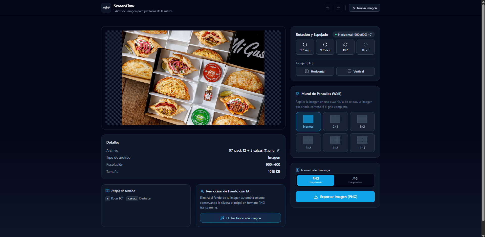

# 🎬 Clipper

**Clipper** es un editor de video web moderno, rápido y privado diseñado para ejecutarse completamente en el navegador. Procesa y edita tus videos de manera local utilizando recursos del cliente, asegurando que tus archivos nunca se suban a un servidor externo.

---

## ✨ Características Principales

*   **🔍 Línea de Tiempo de Alta Precisión:** Corta videos visualizando miniaturas continuas de los fotogramas y previsualizaciones instantáneas al pasar el cursor (hover preview).
*   **📐 Rotación y Espejado:** Corrige la orientación del video girando en 90°/180°/270° o aplicando volteado (flip) horizontal y vertical.
*   **⚡ Velocidad y Volumen:** Modifica el ritmo del video (0.25x a 2.0x) y ajusta los niveles de volumen o silencia la pista con controles intuitivos.
*   **🏢 Conversión a Video Wall:** Divide tu video de manera simétrica en cuadrículas multipantalla (2×1, 1×2, 2×2, 3×2, 2×3) simulando paneles físicos reales.
*   **💾 Exportación Instantánea:** Descarga tus clips editados directamente en formatos **MP4** o **WebM** listos para compartir.

---

## 📸 Galería del Proyecto

Disfruta de una experiencia de edición fluida e interactiva a través de una interfaz de usuario minimalista y optimizada para el rendimiento:

<table width="100%">
  <tr>
    <td width="50%" align="center" valign="top">
      
        
      <strong>Pantalla de Inicio</strong> — interfaz limpia y zona de dropzone para arrastrar videos
    </td>
    <td width="50%" align="center" valign="top">
      
        
      <strong>Carga de Archivos</strong> — selector local para cargar de manera segura y privada
    </td>
  </tr>
  <tr>
    <td width="50%" align="center" valign="top">
      
        
      <strong>Espacio de Trabajo</strong> — timeline de miniaturas continuo y paneles de control posicionados
    </td>
    <td width="50%" align="center" valign="top">
      
        
      <strong>Opciones y Controles</strong> — ajustes de calidad, resoluciones y modos de exportación
    </td>
  </tr>
</table>

---

## 🛡️ Privacidad & Seguridad
Al ser una aplicación **Client-Side** (local-first), la edición de video se procesa enteramente en tu ordenador por medio de elementos HTML5, Canvas y MediaRecorder. Ningún byte es enviado a la red, lo que garantiza confidencialidad absoluta sobre tus contenidos multimedia.
